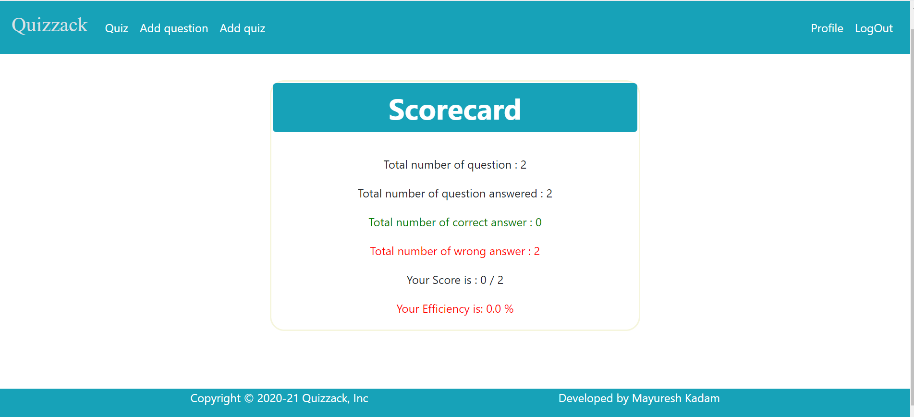

# Quizzack
Quizzack app generated with Django,HTML, CSS5 and Bootstrap

### Features!
  * Quizzack is a quiz website where the user can solve various quiz as per his interest.
  * Quizzack allow user to add various quizzes.
  * The user can create and update his profile.
  * The user can keep track of his quiz attempts and compare his marks.
  
### Technology Stack

  * Frontend: HTML, CSS, JS, Bootstrap4
  * Backend: Python3
  * Framework: Django
  * Database: sqlite
  
  
 ### Quizzack Screenshots

